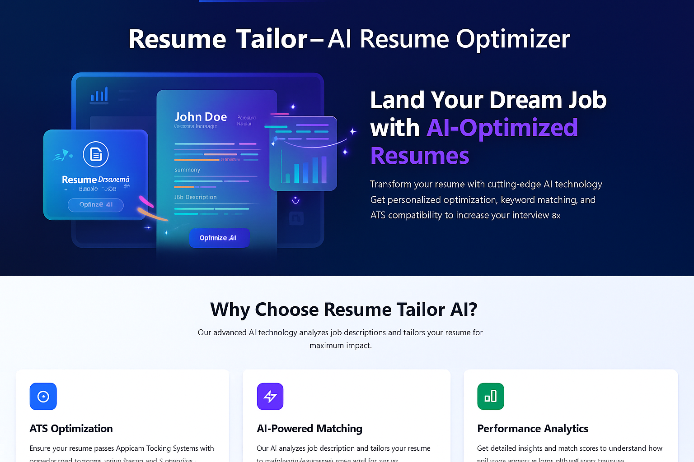
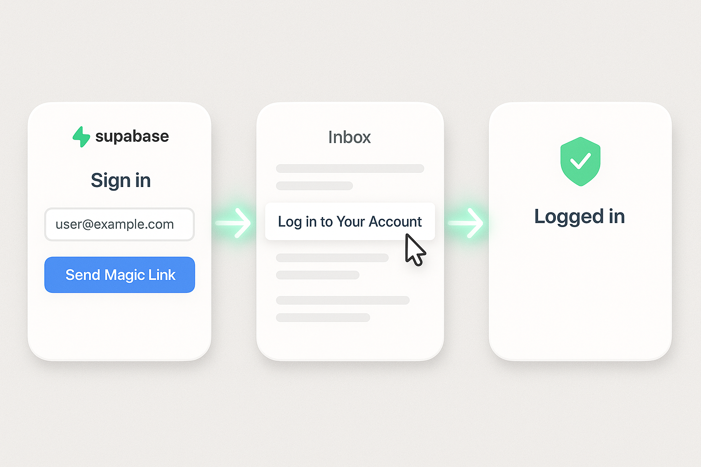
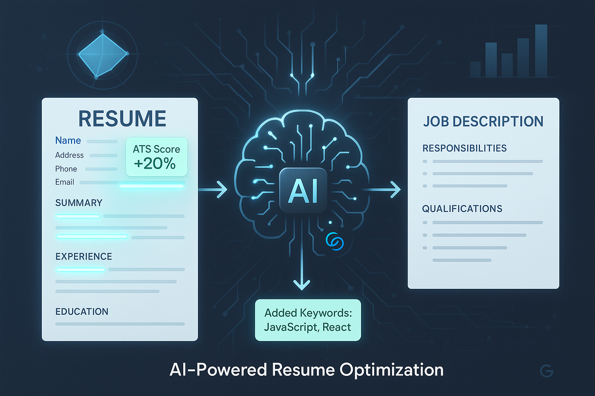
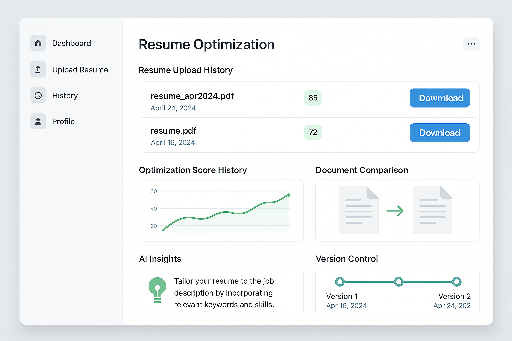
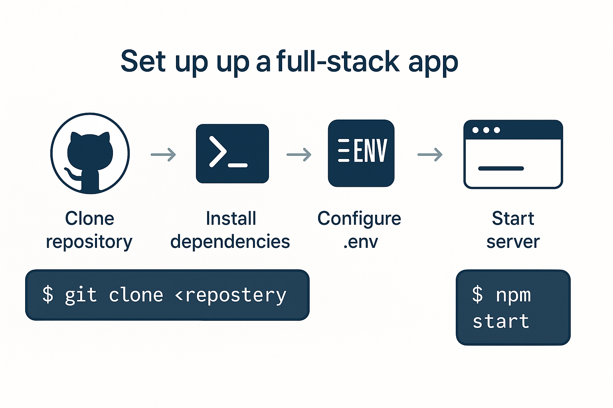
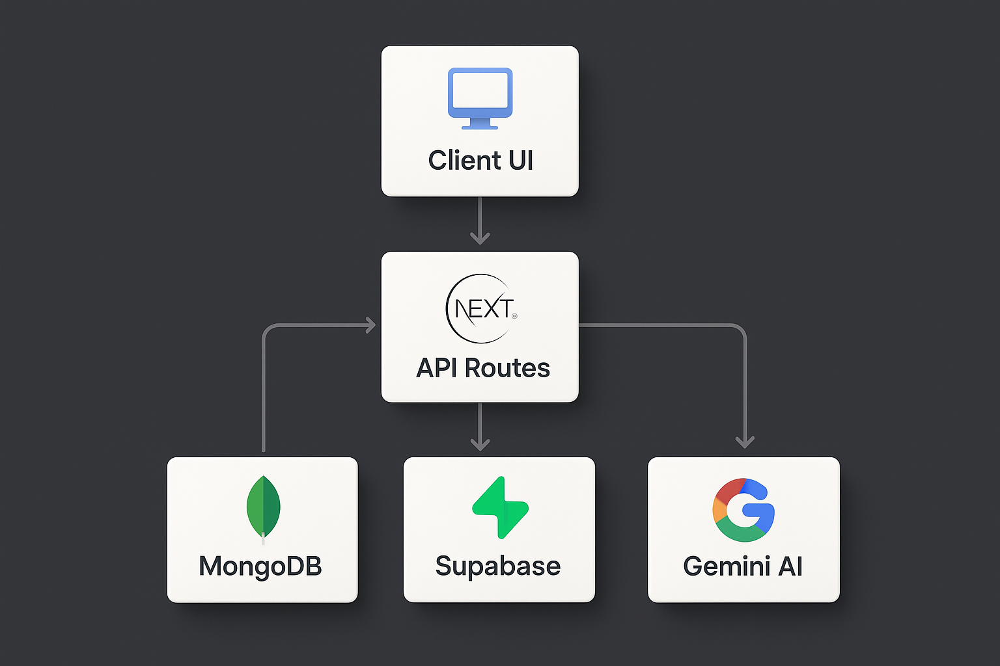
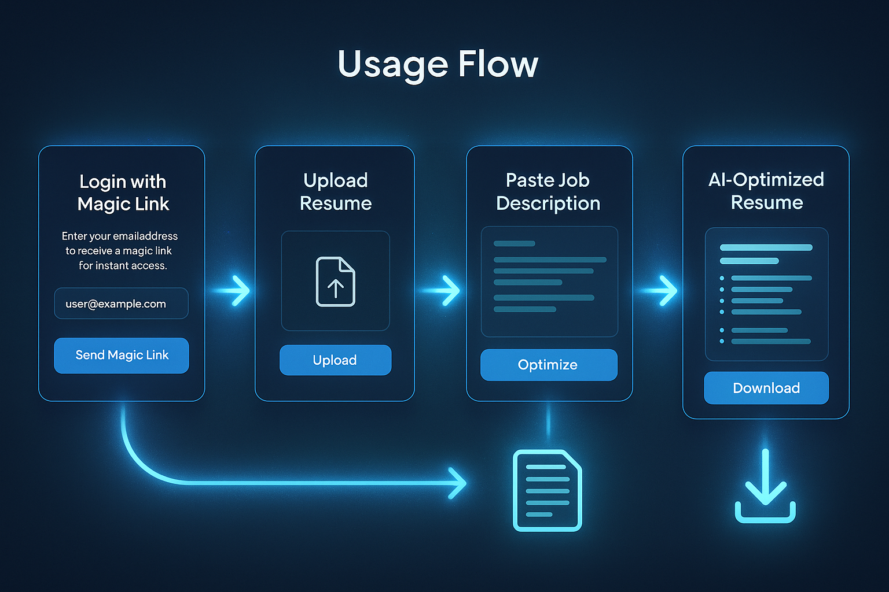
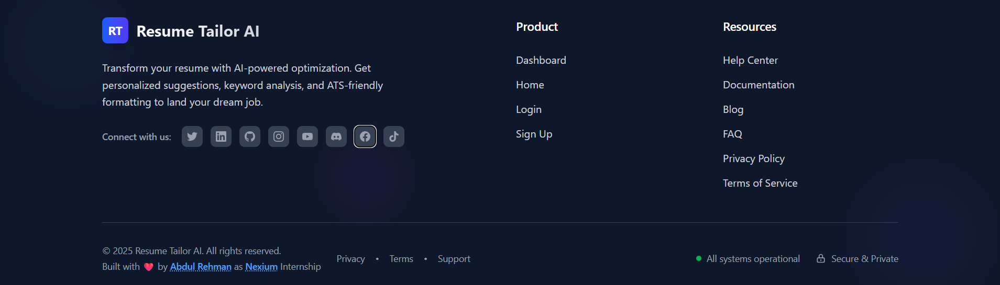

# 🎯 Resume Tailor

> AI-powered resume optimization platform that tailors your resume to specific job descriptions for maximum ATS compatibility and recruiter appeal.



## ✨ Features

### 🔐 Secure Authentication
- **Magic Link Authentication** - Passwordless login via email
- **Supabase Integration** - Enterprise-grade authentication
- **Session Management** - Secure user sessions



### 📄 Document Processing
- **Multi-format Support** - PDF, DOCX, and TXT files
- **Intelligent Parsing** - Extract text while preserving structure
- **File Validation** - Secure upload with type checking

### 🤖 AI-Powered Optimization
- **Google Gemini Integration** - Advanced AI analysis
- **Keyword Optimization** - ATS-friendly keyword suggestions
- **Content Enhancement** - Improve clarity and impact
- **Job-Specific Tailoring** - Match resume to job descriptions



### 📊 Optimization History
- **Track Changes** - View all optimization attempts
- **Compare Versions** - See before/after improvements
- **Export Options** - Download optimized resumes
- **Analytics** - Track optimization success



## 🚀 Quick Start

### Prerequisites

- Node.js 18+ 
- npm or yarn
- MongoDB database
- Supabase account
- Google Gemini API key

### Installation

1. **Clone the repository**
   ```bash
   git clone https://github.com/yourusername/nexium-resume-tailor.git
   cd nexium-resume-tailor
   ```

2. **Install dependencies**
   ```bash
   npm install
   ```

3. **Environment Setup**
   ```bash
   cp .env.example .env.local
   ```

4. **Configure environment variables**
   ```env
   # Supabase Configuration
   NEXT_PUBLIC_SUPABASE_URL=your_supabase_url
   NEXT_PUBLIC_SUPABASE_ANON_KEY=your_supabase_anon_key
   SUPABASE_SERVICE_ROLE_KEY=your_service_role_key
   
   # MongoDB
   MONGODB_URI=your_mongodb_connection_string
   
   # Google Gemini AI
   GEMINI_API_KEY=your_gemini_api_key
   
   # Optional: Email Service
   RESEND_API_KEY=your_resend_api_key
   
   # Optional: n8n Integration
   N8N_WEBHOOK_URL=your_n8n_webhook_url
   ```

5. **Start development server**
   ```bash
   npm run dev
   ```

6. **Open your browser**
   Navigate to [http://localhost:3000](http://localhost:3000)



## 🏗️ Architecture

### Tech Stack

- **Frontend**: Next.js 14, React, TypeScript, Tailwind CSS
- **Backend**: Next.js API Routes, Node.js
- **Database**: MongoDB with Mongoose
- **Authentication**: Supabase Auth
- **AI**: Google Gemini Pro
- **File Processing**: PDF-parse, Mammoth.js
- **Deployment**: Vercel (recommended)

### Project Structure

```
nexium-resume-tailor/
├── app/                    # Next.js App Router
│   ├── api/               # API route handlers
│   ├── auth/              # Authentication pages
│   ├── dashboard/         # Main dashboard
│   ├── login/             # Login page
│   └── signup/            # Signup page
├── api/                   # Legacy API routes
├── ai/                    # AI optimization logic
├── lib/                   # Utility libraries
│   ├── mongodb.ts         # Database connection
│   ├── supabase.ts        # Supabase client
│   └── document-parser.ts # File processing
├── docs/                  # Documentation
└── types/                 # TypeScript definitions
```



## 📖 Usage Guide

### 1. Authentication

1. Visit the application
2. Enter your email address
3. Check your email for the magic link
4. Click the link to authenticate

### 2. Upload Resume

1. Navigate to the dashboard
2. Click "Upload Resume"
3. Select your PDF, DOCX, or TXT file
4. Wait for processing to complete

### 3. Optimize Resume

1. Paste the job description
2. Click "Optimize Resume"
3. Review AI suggestions
4. Download the optimized version



## 🔧 Configuration

### Supabase Setup

1. Create a new Supabase project
2. Configure authentication settings:
   - Enable email authentication
   - Set site URL: `http://localhost:3000`
   - Add redirect URL: `http://localhost:3000/auth/callback`
3. Copy your project URL and anon key

Detailed setup guide: [Supabase Configuration](./docs/supabase-setup.md)

### MongoDB Setup

1. Create a MongoDB Atlas cluster
2. Create a database user
3. Whitelist your IP address
4. Copy the connection string

### Google Gemini API

1. Visit [Google AI Studio](https://makersuite.google.com/app/apikey)
2. Create a new API key
3. Add it to your environment variables

## 🚀 Deployment

### Vercel (Recommended)

1. **Connect your repository**
   ```bash
   vercel --prod
   ```

2. **Configure environment variables**
   - Add all environment variables in Vercel dashboard
   - Update Supabase redirect URLs for production

3. **Deploy**
   ```bash
   git push origin main
   ```

### Other Platforms

- **Netlify**: Use `npm run build` and deploy `out/` folder
- **Railway**: Connect GitHub repository
- **DigitalOcean**: Use App Platform

## 🧪 Testing

### Run Tests

```bash
# Unit tests
npm run test

# Integration tests
npm run test:integration

# E2E tests
npm run test:e2e
```

### Manual Testing

1. Test magic link authentication
2. Upload different file formats
3. Test AI optimization with various job descriptions
4. Verify optimization history

## 🤝 Contributing

1. Fork the repository
2. Create a feature branch
   ```bash
   git checkout -b feature/amazing-feature
   ```
3. Commit your changes
   ```bash
   git commit -m 'Add amazing feature'
   ```
4. Push to the branch
   ```bash
   git push origin feature/amazing-feature
   ```
5. Open a Pull Request

## 📝 API Documentation

### Authentication Endpoints

- `POST /api/auth/magic-link` - Send magic link
- `GET /auth/callback` - Handle auth callback

### Resume Processing

- `POST /api/parse-document` - Parse uploaded resume
- `POST /api/optimize-resume` - Optimize resume with AI
- `GET /api/optimizations` - Get optimization history

### Example API Usage

```javascript
// Send magic link
const response = await fetch('/api/auth/magic-link', {
  method: 'POST',
  headers: { 'Content-Type': 'application/json' },
  body: JSON.stringify({ email: 'user@example.com' })
});

// Optimize resume
const optimization = await fetch('/api/optimize-resume', {
  method: 'POST',
  headers: { 'Content-Type': 'application/json' },
  body: JSON.stringify({
    resumeText: 'Your resume content...',
    jobDescription: 'Job requirements...'
  })
});
```

## 🔒 Security

- **Authentication**: Supabase handles secure authentication
- **File Upload**: Validated file types and sizes
- **API Protection**: Rate limiting and input validation
- **Environment Variables**: Sensitive data in environment variables
- **HTTPS**: SSL/TLS encryption in production

## 📊 Performance

- **File Processing**: Optimized for large documents
- **AI Requests**: Efficient prompt engineering
- **Caching**: MongoDB optimization history
- **CDN**: Static assets via Vercel Edge Network

## 🐛 Troubleshooting

### Common Issues

**Magic links not working:**
- Check Supabase email configuration
- Verify redirect URLs
- Check spam folder

**File upload fails:**
- Ensure file size < 10MB
- Check supported formats (PDF, DOCX, TXT)
- Verify file is not corrupted

**AI optimization errors:**
- Verify Gemini API key
- Check API quota limits
- Ensure resume text is extracted properly

### Debug Mode

```bash
# Enable debug logging
DEBUG=true npm run dev
```

## 📄 License

This project is licensed under the MIT License - see the [LICENSE](LICENSE) file for details.

## 🙏 Acknowledgments

- [Next.js](https://nextjs.org/) - React framework
- [Supabase](https://supabase.com/) - Backend as a Service
- [Google Gemini](https://ai.google.dev/) - AI capabilities
- [MongoDB](https://www.mongodb.com/) - Database
- [Vercel](https://vercel.com/) - Deployment platform

## 📞 Support

- **Documentation**: [Project Wiki](./docs/)
- **Issues**: [GitHub Issues](https://github.com/yourusername/nexium-resume-tailor/issues)
- **Discussions**: [GitHub Discussions](https://github.com/yourusername/nexium-resume-tailor/discussions)

---

<div align="center">
  
  <br>
  <strong>Built with ❤️ for job seekers worldwide</strong>
</div>

## 🔄 Changelog

### v1.0.0 (Latest)
- ✅ Magic link authentication
- ✅ Multi-format resume parsing
- ✅ AI-powered optimization
- ✅ Optimization history
- ✅ Responsive design

### Roadmap
- 🔄 Resume templates
- 🔄 Batch processing
- 🔄 Advanced analytics
- 🔄 Team collaboration
- 🔄 API access

---

**Star ⭐ this repository if you find it helpful!**
